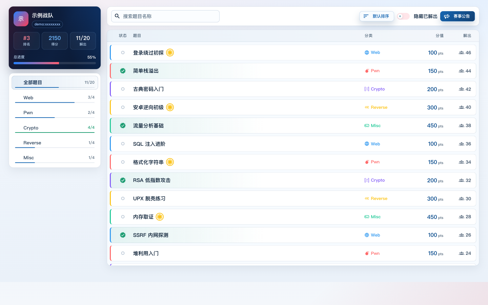
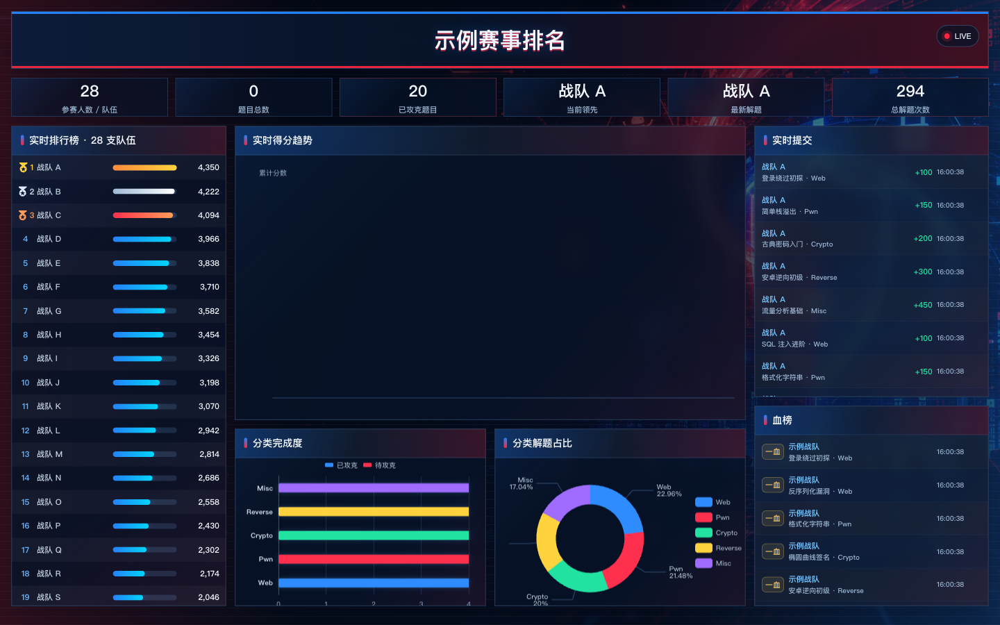
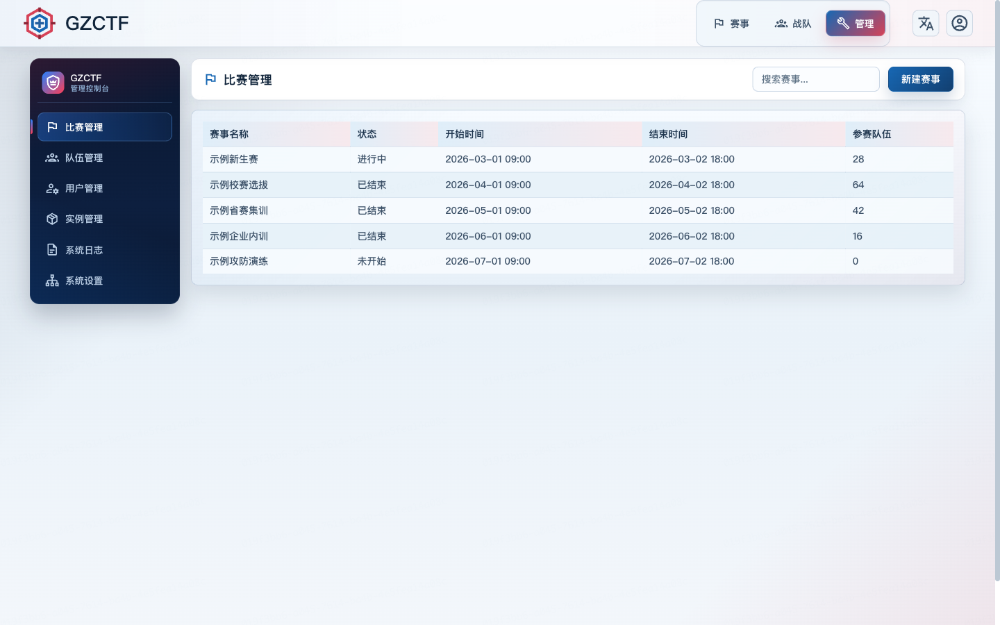
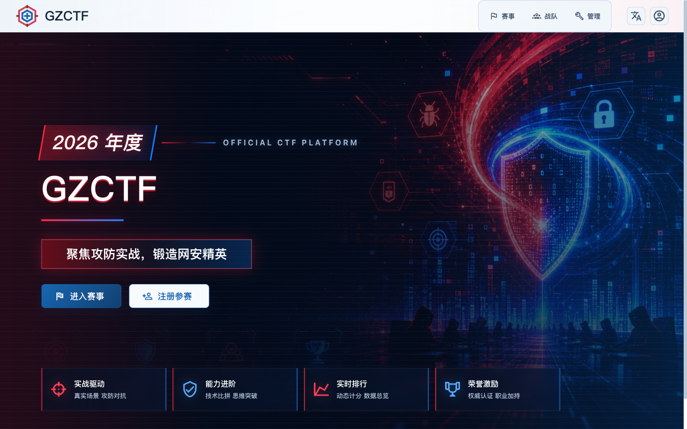
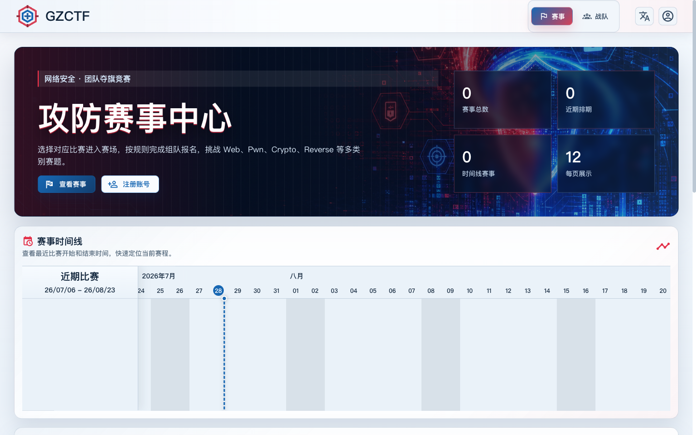
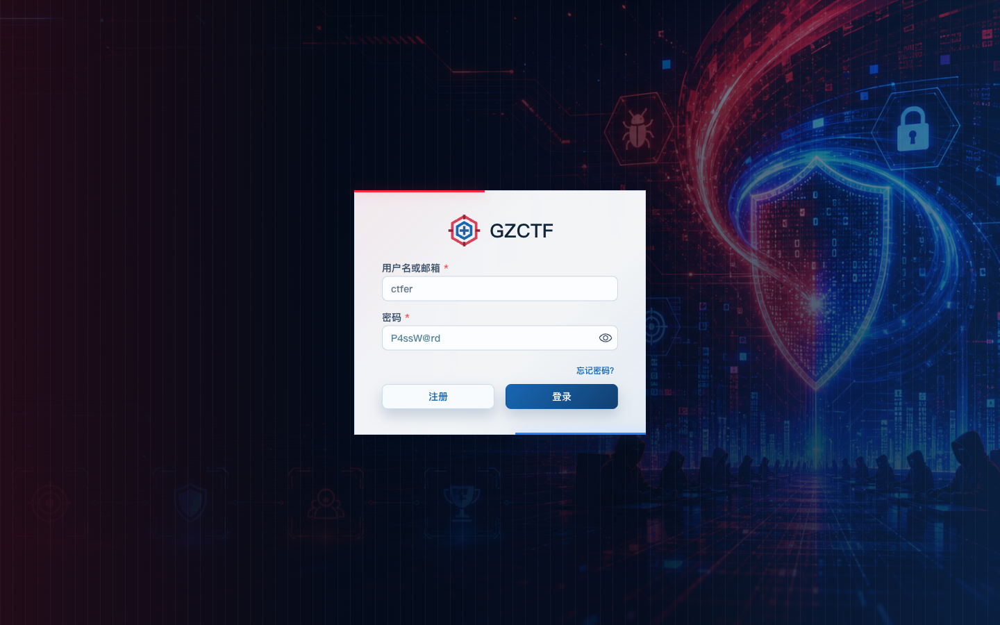

# GZCTF（二次开发版）

面向高校与企业培训场景的 CTF 夺旗竞赛平台，支持多类别赛题、动态靶机、动态计分、组队参赛与实时排行大屏。

> **本项目基于开源项目 [GZCTF](https://github.com/GZTimeWalker/GZCTF) 的开放核心（AGPLv3）二次开发。**
> GZCTF 是其权利人的商标，本项目与其官方无从属或背书关系。
>
> This project is based on the open core of [GZCTF](https://github.com/GZTimeWalker/GZCTF) (AGPLv3).
> GZCTF is a trademark of its respective owner. No endorsement implied.

## 技术栈

| 层 | 技术 |
| --- | --- |
| 后端 | ASP.NET Core (.NET 10)、EF Core、PostgreSQL、Redis |
| 前端 | React 19、Vite、Mantine、TypeScript |
| 部署 | Docker Compose |
| 靶机 | Docker / Kubernetes |

## 快速开始

生产部署请完整阅读 [`DEPLOY_UBUNTU22.md`](DEPLOY_UBUNTU22.md)（Ubuntu 22.04 + Docker Compose，含 Nginx HTTPS、备份恢复与排错）。

```bash
cp .env.example .env
# 编辑 .env：至少修改 GZCTF_PUBLIC_ENTRY、GZCTF_ADMIN_PASSWORD、
# POSTGRES_PASSWORD、GZCTF_XOR_KEY
mkdir -p data/files data/db
docker compose up -d --build
```

本地前端开发（需后端已在运行）：

```bash
cd src/GZCTF/ClientApp
pnpm install
pnpm dev --host        # 默认 http://localhost:63000，API 代理至 VITE_BACKEND_URL
```

生成可部署源码包：

```bash
./build-release.sh     # 输出到上级目录，自动排除 node_modules / 数据 / .env
```

## 相对上游的主要改动

> 以下截图均使用虚构的演示数据。

### 1. 选手答题页 — 重新设计

由「顶部大信息卡 + 横向分类标签 + 卡片网格」改为 **左侧分类导航 + 主区列表视图**。



- **左侧栏**：战队状态卡（排名 / 得分 / 解出数 / 总进度条）+ 分类导航，每个分类带独立完成进度条，一眼看出哪类还没打完
- **主区列表**：状态 / 题目 / 分类 / 分值 / 解出数五列，比卡片网格密度更高，题量大时不必反复滚动
- **新增能力**：题目名称搜索、三档排序切换（默认 / 按分值 / 按解出数）、过截止时间的题目自动置灰
- 已解出的题目以绿色渐变 + 勾选标识区分，一血 / 二血 / 三血图标内联展示

### 2. 排行榜大屏 — 展示全部队伍并支持滚动

上游硬编码 `slice(0, 25)`，**仅展示前 25 名**，之后的队伍无法在大屏上看到自己的分数。



- 解除数量限制，渲染**全部参赛队伍**，面板标题实时显示队伍总数
- 面板高度改为有界（`grid-template-rows: minmax(0, 1fr)`），超出部分**在面板内部滚动**，避免队伍多时把整个大屏布局撑垮
- 深色面板内补充可见的滚动条样式
- 修正分类占比饼图标签的换行符转义错误

### 3. 管理后台 — 布局重构

由顶部标签页（`IconTabs`）改为**独立侧边导航布局**。



- 深色侧边栏：品牌区 + 六个带高亮条的导航项，随页面滚动吸附
- 右侧独立标题栏，承载页面标题与操作区
- 各管理页的 props 接口保持不变，无需逐页改造

### 4. 首页文案完全后台可配



新增 `HomeTitle` / `HomeSubtitle` / `HomeEyebrow` / `HomeBadge` / `HomeFeatures` /
`HomeEnterText` / `HomeRegisterText` 七个配置字段，**与「平台名称 / 平台标语」相互独立**：

| 配置项 | 影响范围 |
| --- | --- |
| 平台名称 / 平台标语 | 浏览器标题、导航栏、页脚、邮件 |
| 首页主标题 / 副标题 | **仅**首页大屏 |

留空时自动回退到平台名称，因此「只改首页大字、不动浏览器标题」无需改代码。

### 5. 赛事列表与登录页





### 6. 可访问性与主题

- 全站文字对比度修正至满足 **WCAG AA（4.5:1）**：次要文字由 4.43 提升至 5.4+，
  输入框 placeholder 由 2.8 提升至 4.8+
- 修复登录卡在浅色主题下输入文字近乎不可见的问题（浅底浅字）
- 顶栏 / 页脚 / 登录卡统一为浅色主题，与站内内容区一致

## 许可证

本仓库为**双许可**结构，与上游保持一致：

### 核心代码：AGPLv3

除下方「受限组件」外，全部源码依 [GNU Affero General Public License v3.0](LICENSE.txt) 授权。

> ⚠️ **AGPLv3 第 13 条**：若你通过网络向用户提供本平台的服务（例如举办线上比赛），
> 必须向这些用户提供完整的对应源码。请勿在闭源的前提下对外提供服务。

### 受限组件：LicenseRef-GZCTF-Restricted

以下路径**不在 AGPLv3 覆盖范围内**，依 [`licenses/LicenseRef-GZCTF-Restricted.txt`](licenses/LicenseRef-GZCTF-Restricted.txt) 授权，
本仓库中保持**原样未修改**：

- `src/GZCTF/Services/Container/Manager/*`
- `src/GZCTF/ClientApp/src/hooks/useConfig.ts`
- `src/GZCTF/ClientApp/src/components/Copyright.tsx`

未经权利人书面授权，**不得修改或删除**这些组件。详见 [`LICENSE_ADDENDUM.txt`](LICENSE_ADDENDUM.txt)
与 [`PROPRIETARY_COMPONENTS.md`](PROPRIETARY_COMPONENTS.md)。

### 商标

「GZCTF」/「GZ::CTF」名称与标识为上游权利人的商标，使用规则见 [`TRADEMARKS.md`](TRADEMARKS.md)。
本项目仅作事实性说明引用，未使用上游的品牌标识文件。

### 二次分发者须知

若你要基于本仓库继续分发或部署，请确保：

1. 以 AGPLv3 发布你的修改，并向网络用户提供源码获取方式
2. 保留 `LICENSE.txt`、`LICENSE_ADDENDUM.txt`、`NOTICE`、`TRADEMARKS.md`、
   `PROPRIETARY_COMPONENTS.md` 与 `licenses/` 目录
3. 保持三个受限组件逐字节原样，并保留其文件头版权声明
4. 保留页面底部的上游署名
5. 不使用上游的品牌标识文件，也不以暗示官方背书的方式使用其商标
